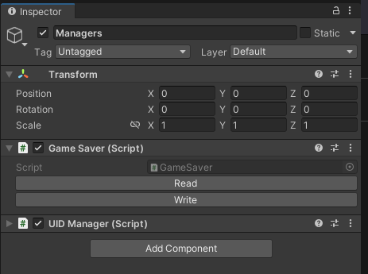
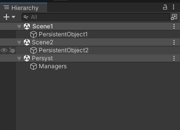
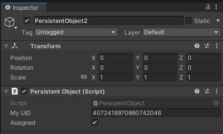

# Scene Setup

Components that you need to get the ball... saving.

## Managers
In order to enable `Persyst` serialization, you must add a [UIDManager](/) and a [GameSaver](/) component to a `GameObject` in your scene **(during edit mode!)**. 

If your game can have multiple scenes loaded at the same time, I recommend placing the `GameObject` with the manager classes in a separate scene that is always kept open. If your game only has one scene open at a time, you can get away with having a separate object in each scene, although it is still recommended to have a separate scene for the managers and just swap the other scenes out with additive loading, for reasons discussed [here](serializing_references).

## PersistentObject Component

Each `GameObject` that contains information you want to serialize needs to have a [PersistentObject](/) component. The [PersistentObject](/) will automatically be assigned a UID (unique identifier) upon being added, and you don't need to touch it at all.

If you get an error, make sure the [UIDManager](/) already exists before you add any [PersistentObject](/) to the scene.

The [PersistentObject](/) component only affects the `GameObject` it is attached to, not the rest of the hierarchy. If a child `GameObject` also has information that needs to be serialized, it needs to have its own [PersistentObject](/).

## Saving and Loading

As you can see in section [Managers](#managers), the `GameSaver` component has a couple of buttons that you can use to manually save and load save files. Handy for testing, but of course not quite what you would do for real. The buttons map to two public methods in the `GameSaver` class (`void readFile(string path)` and `void writeFile(string path)`, respectively), which you will probably want to invoke from your own game-logic code at the appropriate time.

When you call these methods, all `PersistentObjects` that are active in the scene will receive a callback and do their thing: gather a list of all saveable `MonoBehaviours` attached to that same `GameObject`, and find all the information that needs to be serialized or deserialized in each of those `MonoBehaviours`. 