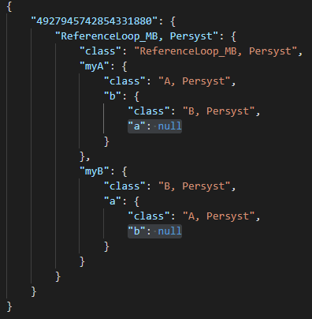

# Reference loops

Reference loops in objects serialized by value are ignored. Something like this:

```cs 
public class ReferenceLoop_MB : MonoBehaviour, ISaveable
{
	[SaveThis] A myA;
	[SaveThis] B myB;
    void Start()
    {
        myA= new A();
		myB = new B();
		myA.b = myB;
		myB.a = myA;
    }

}

	public class A : ISaveable{
		[SaveThis] public B b;
	}

	public class B : ISaveable{
		[SaveThis] public A a;
	}
```

will be serialized like this:

